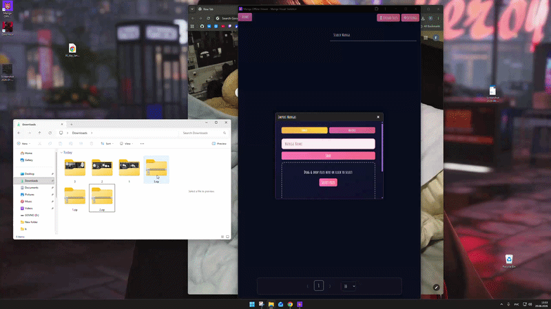
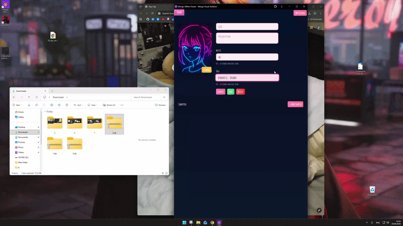
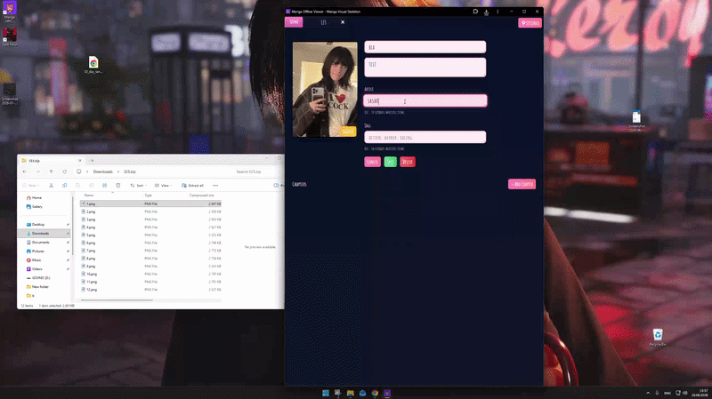
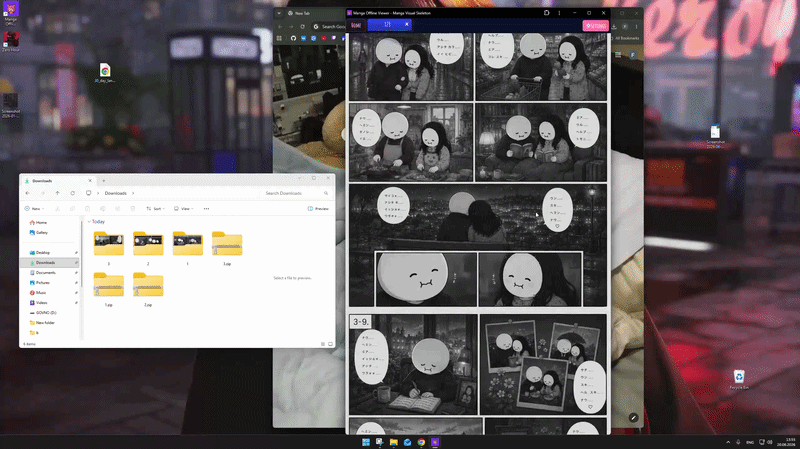

<div align="center">

# MangaOfflineViewer


### Offline-first Manga Reader (PWA)

Minimal • Fully Offline • No Backend Required

<p>
  <a href="https://zarar384.github.io/MangaOfflineViewer/">Live Demo (GitHub Pages)</a>
  •
  <a href="https://manga-offline-viewer.netlify.app/">Live Demo (Netlify)</a>
  •
  <a href="https://youtu.be/-3GngfbSlKk">Video Demo</a>
</p>

<p>
  
  
  
  
</p>

</div>

---

## Quick Overview





---


## System Overview

The system consists of two logical parts:

1. **Client** — Angular 20-based PWA, fully functional offline  
2. **Helper Server (optional)** — used only for CPU-intensive preprocessing (e.g. MHTML)

The client is the source of truth for application state and data.
The client is responsible for UI rendering, local persistence, offline operation, and optional interaction with the helper server.

---

## Architecture

```
Client (Browser)
 ├─ Angular SPA
 │   ├─ Presentation Layer
 │   ├─ Application Services
 │   ├─ Storage Layer (Dexie / IndexedDB)
 │   └─ Basic navigation (no route-driven state)
 │
 ├─ Service Worker (ngsw)
 │   ├─ App shell caching
 │   ├─ Offline routing
 │   └─ Update lifecycle
 │
 └─ Local Persistence
     └─ IndexedDB

Optional Helper Server
 └─ Heavy preprocessing (MHTML → structured assets)
```

---

## Main Page



---

## Storage Strategy

### IndexedDB (Primary Storage)

IndexedDB is used as the only persistent storage.  
Access is abstracted via **Dexie**.

Reasons for Dexie:
- Stable async API over IndexedDB
- Schema versioning and migrations
- Indexed queries and transactional writes

There is no server-side database dependency.

---

## Data Ownership Model

- Data is owned by the client
- Server never stores authoritative state
- Server output is treated as importable artifacts

This avoids synchronization complexity and enables full offline usage.

---

## Service Worker

### Implementation

- Uses Angular built-in Service Worker
- Configured via `ngsw-config.json`
- No custom worker logic

### Responsibilities

- Cache application shell
- Serve cached assets offline
- Control update activation

The Service Worker **does not handle domain data** — only static assets.

---

## Application State

The application operates with two types of state:

### Persistent Application Data

This includes all data required for the application to function meaningfully.

Characteristics:
- Stored in IndexedDB via Dexie
- Persists across reloads and offline sessions
- Required for reading and navigation

Examples:
- Manga metadata
- Pages and extracted images
- Reading progress

### UI-related State

UI-related state is handled separately and is not part of the persistent data model.

Characteristics:
- Transient
- Does not affect data integrity
- Can be safely reset
- Not involved in offline guarantees

---

## Reader Page



---

## Offline Behavior

- First load requires network
- After installation:
  - App loads from cache
  - IndexedDB provides data access
  - No network dependency

Offline behavior is deterministic and predictable.

---

## Optional Helper Server

### Purpose

The server exists to offload tasks that are inefficient or unsafe in a browser context.

Primary use case:
- Parsing and preprocessing complex **MHTML** files
- Extracting structured data consumable by the client
  
---

## Communication Model

- UI → Services: direct method calls
- Services → IndexedDB: Dexie API
- Client → Server (optional): HTTP requests
- Service Worker intercepts asset requests only

No bidirectional or real-time communication.

---

## Data Flow

1. Application bootstrap
2. Service Worker registration
3. Dexie database initialization
4. Content import (local or via server)
5. IndexedDB write
6. Reader UI consumes stored data
7. Offline operation continues

---

## Design Constraints

- Browser storage quotas apply
- No cross-device sync
- Single-user, single-device data model
